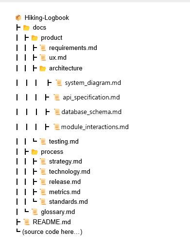

# Hiking Logbook – Documentation

Welcome to the documentation hub for the **Hiking Logbook** project.  
This file serves as a **table of contents** and guide to navigate both **product documentation** (what we are building) and **process documentation** (how we are building it).  

> ⚠️ **Note:**  
> This documentation is a **living document**.  
> It may evolve as the project progresses and new requirements, features, or feedback are introduced.  
> All updates will be traceable through Git history.

---

## 📖 Table of Contents

### Product Documentation
1. [Functional & Non-Functional Requirements](https://hikers-for-life.github.io/Hiking-Logbook/product/requirements.html)
2. [UX Documentation](https://hikers-for-life.github.io/Hiking-Logbook/product/ux.html)
3. **Architecture & Design**
     - [API specifications](https://hikers-for-life.github.io/Hiking-Logbook/product/architecture/api_specifications.html)
     - [Database schema](https://hikers-for-life.github.io/Hiking-Logbook/product/architecture/database_schema.html)
     - [Module interactions](https://hikers-for-life.github.io/Hiking-Logbook/product/architecture/module_interactions.html)
4. [Testing Documentation](https://hikers-for-life.github.io/Hiking-Logbook/product/testing.html)

### Process Documentation
5. [Strategy Roadmap](https://hikers-for-life.github.io/Hiking-Logbook/process/strategy.html) : Project structure, project management           methodology, goals, project alignment, and development roadmap. 
6. [Technology Roadmap](https://hikers-for-life.github.io/Hiking-Logbook/process/technology.html) : Tech Stack
7. [Release Roadmap](https://hikers-for-life.github.io/Hiking-Logbook/process/release.html)
8. [Metrics](https://hikers-for-life.github.io/Hiking-Logbook/process/metrics.html)
9. [Standards](https://hikers-for-life.github.io/Hiking-Logbook/process/standards.html) : Coding standards, commit conventions, Git           methodology, testing standards, documentation standards, branch rules and CI pipeline, Developer setup.
10. **Development guides**
      - [Contributing](https://hikers-for-life.github.io/Hiking-Logbook/process/development/contributing.html)
      - [API setup](https://hikers-for-life.github.io/Hiking-Logbook/process/development/api_setup.html)
      - [Database setup](https://hikers-for-life.github.io/Hiking-Logbook/process/development/database_setup.html)
      - [Site setup](https://hikers-for-life.github.io/Hiking-Logbook/process/development/site_setup.html)
      - [Running locally](https://hikers-for-life.github.io/Hiking-Logbook/process/development/running_locally.html)

---

## 🗂 Documentation Structure

  

---

## 📌 Documentation Standards

- **File Format**: Markdown (`.md`) for readability on GitHub and easy conversion to PDF if required.  
- **Naming Conventions**: Lowercase filenames with underscores if needed (e.g., `architecture_design.md`).  
- **Cross-Referencing**: Each requirement is traceable to UX artifacts, architecture components, and test cases.  
- **Versioning**: Documentation evolves with each sprint and release. Previous versions are tracked in Git history.  

---

## 📊 Metrics Approach

To measure project quality and progress, we track:
- Story points completed per sprint.  
- Number of test cases written vs. passed.  
- Bugs logged and resolved.  
- Deployment success rate.  

---

## 📚 Glossary

- **Logbook**: A digital record of hikes including notes, weather, and GPS routes.  
- **Planned Hike**: A scheduled hike with route, checklist, and invited friends.  
- **Achievements**: User-defined goals (e.g., total distance, number of hikes) with tracked progress.  
- **Activity Feed**: Timeline showing hikes and milestones from friends.  

---

## 🚀 Purpose of this Documentation

This documentation is designed not just to explain the final product but to demonstrate the **process, quality standards, and intentionality** behind its development. It reflects both the *engineering mindset* and *collaborative teamwork* that went into the Hiking Logbook project.

