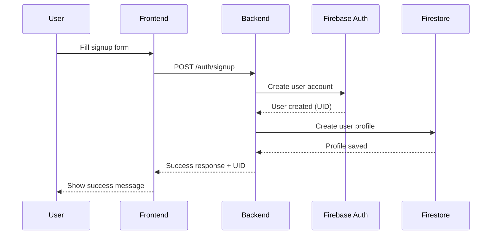
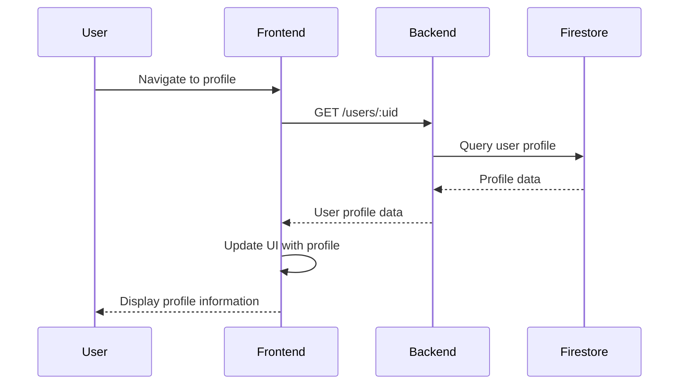

# Module Interactions - Sprint 1

This document explains how different parts of the Hiking Logbook system interact with each other for **Sprint 1**, focusing on user authentication and basic user profile storage.

## Sprint 1 Scope

**What's Included:**

- User signup via Firebase Authentication
- Basic user profile creation and retrieval in Firestore
- Simple frontend-backend communication

**What's NOT Included (Future Sprints):**

- JWT token management
- Advanced user profile operations
- Hikes, trails, and other data management
- Complex social features

## System Architecture

### High-Level Architecture

```
┌─────────────────┐    HTTP/HTTPS    ┌─────────────────┐
│   Frontend      │ ◄──────────────► │    Backend      │
│   (React)       │                  │  (Express.js)   │
└─────────────────┘                  └─────────────────┘
         │                                     │
         │                                     │
         │ Firebase SDK                        │ Firebase Admin SDK
         │                                     │
         ▼                                     ▼
┌─────────────────┐                  ┌─────────────────┐
│  Firebase Auth  │                  │ Firebase Admin  │
│  (Client SDK)   │                  │   (Server SDK)  │
└─────────────────┘                  └─────────────────┘
         │                                     │
         │                                     │
         └─────────────┬───────────────────────┘
                       │
                       ▼
              ┌─────────────────┐
              │ Firebase        │
              │ Firestore       │
              │ (Database)      │
              └─────────────────┘
```

### Module Responsibilities

#### Frontend (React)

- **User Interface**: Login/signup forms, basic profile display
- **State Management**: User authentication state, form data
- **API Communication**: HTTP requests to backend
- **Routing**: Client-side navigation between views

#### Backend (Express.js)

- **API Endpoints**: Basic routes for user operations
- **Request Validation**: Input validation and sanitization
- **Database Operations**: Firebase Admin SDK integration
- **Error Handling**: Centralized error management

#### Database (Firebase Firestore)

- **Data Storage**: User profiles and authentication data
- **Security Rules**: Access control and data protection
- **Real-time Sync**: Basic live updates (future enhancement)

#### Authentication (Firebase Auth)

- **User Identity**: Email/password authentication
- **Account Creation**: User registration and management

## Data Flow Diagrams

### User Signup Flow

#### 1. User Signup Process



#### 2. User Profile Retrieval



## API Interactions

### Authentication Endpoints

#### POST /auth/signup

**Purpose**: Create new user account and profile

**Frontend Request**:

```javascript
const response = await fetch("/auth/signup", {
  method: "POST",
  headers: {
    "Content-Type": "application/json",
  },
  body: JSON.stringify({
    email: "user@example.com",
    password: "password123",
    displayName: "John Doe",
    bio: "Hiking enthusiast",
  }),
});
```

**Backend Processing**:

```javascript
// 1. Validate input data
// 2. Create user in Firebase Auth
// 3. Create profile in Firestore
// 4. Return success response
```

**Response Handling**:

```javascript
if (response.ok) {
  const data = await response.json();
  // Handle success - redirect to profile or dashboard
} else {
  // Handle error - show error message
}
```

### User Management Endpoints

#### GET /users/:uid

**Purpose**: Retrieve user profile by UID

**Frontend Request**:

```javascript
const response = await fetch(`/users/${uid}`);
```

**Backend Processing**:

```javascript
// 1. Validate UID parameter
// 2. Query Firestore for user profile
// 3. Return profile data or error
```

**Response Handling**:

```javascript
if (response.ok) {
  const profile = await response.json();
  // Update UI with profile data
} else {
  // Handle error - user not found, etc.
}
```

## Error Handling

### Common Error Scenarios

#### 1. Validation Errors (400)

```javascript
{
  "error": "Validation failed",
  "details": "Email is required"
}
```

#### 2. User Already Exists (409)

```javascript
{
  "error": "User already exists"
}
```

#### 3. User Not Found (404)

```javascript
{
  "error": "User not found"
}
```

#### 4. Server Errors (500)

```javascript
{
  "error": "Internal server error"
}
```

### Frontend Error Handling

```javascript
try {
  const response = await fetch("/auth/signup", {
    method: "POST",
    headers: { "Content-Type": "application/json" },
    body: JSON.stringify(userData),
  });

  if (!response.ok) {
    const errorData = await response.json();
    throw new Error(errorData.error);
  }

  // Handle success
} catch (error) {
  // Display error message to user
  setError(error.message);
}
```

## State Management

### Authentication State

#### Frontend State Structure

```javascript
const [authState, setAuthState] = useState({
  isAuthenticated: false,
  user: null,
  loading: false,
  error: null,
});
```

#### State Updates

```javascript
// After successful signup
setAuthState({
  isAuthenticated: true,
  user: { uid: response.uid, email: userData.email },
  loading: false,
  error: null,
});

// After error
setAuthState((prev) => ({
  ...prev,
  loading: false,
  error: error.message,
}));
```

### Form State Management

```javascript
const [formData, setFormData] = useState({
  email: "",
  password: "",
  displayName: "",
  bio: "",
});

const handleInputChange = (e) => {
  setFormData({
    ...formData,
    [e.target.name]: e.target.value,
  });
};
```

## Security Considerations

### Input Validation

#### Frontend Validation

```javascript
const validateForm = () => {
  const errors = [];

  if (!email || !isValidEmail(email)) {
    errors.push("Valid email is required");
  }

  if (!password || password.length < 8) {
    errors.push("Password must be at least 8 characters");
  }

  if (!displayName || displayName.length < 2) {
    errors.push("Display name must be at least 2 characters");
  }

  return errors;
};
```

#### Backend Validation

```javascript
const validateSignupData = (data) => {
  const errors = [];

  if (!data.email || !isValidEmail(data.email)) {
    errors.push("Valid email is required");
  }

  if (!data.password || data.password.length < 8) {
    errors.push("Password must be at least 8 characters");
  }

  if (!data.displayName || data.displayName.length < 2) {
    errors.push("Display name must be at least 2 characters");
  }

  return errors;
};
```

### Firebase Security Rules

```javascript
rules_version = '2';
service cloud.firestore {
  match /databases/{database}/documents {
    match /users/{userId} {
      allow read, write: if request.auth != null &&
        request.auth.uid == userId;
    }
  }
}
```

## Performance Considerations

### Database Operations

- **Single Document Operations**: User profiles are single documents
- **Efficient Queries**: Simple UID-based lookups
- **No Complex Joins**: Simple data structure for Sprint 1

### Frontend Optimization

- **Minimal API Calls**: Only fetch data when needed
- **Efficient State Updates**: Avoid unnecessary re-renders
- **Form Validation**: Client-side validation before API calls

## Testing Strategy

### Frontend Testing

```javascript
// Test signup form submission
test("should submit signup form with valid data", async () => {
  render(<SignupForm />);

  fireEvent.change(screen.getByLabelText(/email/i), {
    target: { value: "test@example.com" },
  });

  fireEvent.click(screen.getByRole("button", { name: /sign up/i }));

  await waitFor(() => {
    expect(screen.getByText(/success/i)).toBeInTheDocument();
  });
});
```

### Backend Testing

```javascript
// Test signup endpoint
test("POST /auth/signup should create new user", async () => {
  const userData = {
    email: "test@example.com",
    password: "password123",
    displayName: "Test User",
  };

  const response = await request(app).post("/auth/signup").send(userData);

  expect(response.status).toBe(201);
  expect(response.body).toHaveProperty("uid");
});
```

## Future Enhancements (Post-Sprint 1)

### Planned Module Interactions

- **JWT Token Management**: Secure authentication flow
- **Advanced User Operations**: Profile updates, preferences
- **Data Collections**: Hikes, trails, photos management
- **Real-time Features**: Live updates and notifications
- **Social Features**: Friend management and sharing

### Architecture Evolution

- **Microservices**: Separate services for different features
- **Advanced Caching**: Redis for performance optimization
- **Event-Driven**: Message queues for async operations
- **API Gateway**: Centralized API management

## Troubleshooting

### Common Issues

#### 1. CORS Errors

```javascript
// Backend CORS configuration
app.use(
  cors({
    origin: "http://localhost:3000",
    credentials: true,
  })
);
```

#### 2. Firebase Connection Issues

```javascript
// Check Firebase configuration
const serviceAccount = require("./serviceAccountKey.json");
admin.initializeApp({
  credential: admin.credential.cert(serviceAccount),
});
```

#### 3. Port Conflicts

- Ensure frontend and backend use different ports
- Check for existing processes using the same port

### Debug Tools

- **Frontend**: React DevTools, Browser DevTools
- **Backend**: Console logging, Postman/Thunder Client
- **Database**: Firebase Console, Firebase CLI

---

\*This module interactions document covers **Sprint 1 only** - user authentication and basic profile storage.
