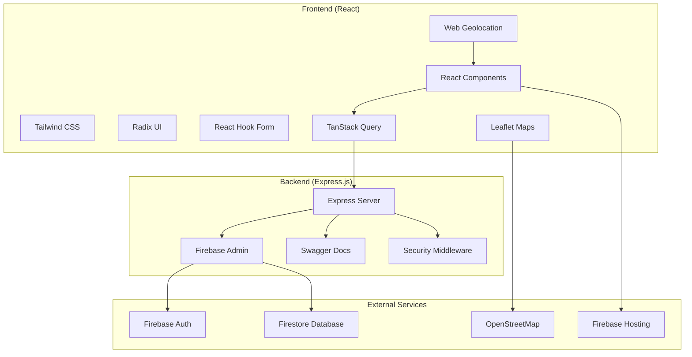

# Third-Party Code Documentation

This document provides comprehensive documentation of all external APIs, libraries, frameworks, and third-party code integrated into the Hiking Logbook application.

## Overview

The Hiking Logbook integrates numerous third-party technologies across frontend, backend, and infrastructure layers to provide a complete hiking tracking and social platform.

---

## Core Framework & Runtime

### 1. React 18.3.1

**What it is:**
JavaScript library for building user interfaces with component-based architecture and virtual DOM.

**Why we use it:**
- Component reusability and maintainability
- Virtual DOM for optimal performance
- Large ecosystem and community support
- Excellent for interactive, stateful UIs
- Built-in hooks for state management

**Key Features Used:**
- Functional components with hooks (useState, useEffect, useContext)
- React Router DOM for client-side routing
- Context API for global state management
- Error boundaries for error handling
- React.memo for performance optimization

**Implementation Examples:**
```javascript
// State management
const [hikes, setHikes] = useState([]);
const [loading, setLoading] = useState(false);

// Context for authentication
const { user, login, logout } = useContext(AuthContext);

// Route handling
<Route path="/hikes" element={<HikesPage />} />
```

---

### 2. Node.js & Express.js 4.21.2

**What it is:**
- **Node.js**: JavaScript runtime for server-side development
- **Express.js**: Fast, unopinionated web framework for Node.js

**Why we use them:**
- JavaScript everywhere (frontend + backend)
- Minimal and flexible framework
- Large middleware ecosystem
- Excellent for REST APIs
- Easy integration with Firebase

**Key Features Used:**
- RESTful API endpoints
- Middleware for authentication, CORS, security
- Error handling middleware
- Request/response processing
- Route organization

**Implementation Examples:**
```javascript
// Route definition
app.get('/api/hikes', authenticateToken, async (req, res) => {
  try {
    const hikes = await getHikesByUser(req.user.uid);
    res.json({ success: true, data: hikes });
  } catch (error) {
    res.status(500).json({ success: false, error: error.message });
  }
});

// Middleware
app.use(cors());
app.use(helmet());
app.use(express.json());
```

---

## Authentication & Database

### 3. Firebase 12.1.0 (Frontend) & Firebase Admin 12.0.0 (Backend)

**What it is:**
Google's Backend-as-a-Service platform providing authentication, database, hosting, and cloud functions.

**Services Used:**
- **Firebase Auth**: User authentication and authorization
- **Firestore**: NoSQL database for real-time data
- **Firebase Hosting**: Frontend deployment platform
- **Firebase Functions**: Serverless backend functions

**Why we use it:**
- Integrated authentication and database
- Real-time data synchronization
- Automatic scaling and infrastructure management
- Offline support and data persistence
- Security rules for fine-grained access control
- Free tier suitable for development

**Implementation:**
```javascript
// Frontend - Authentication
import { initializeApp } from 'firebase/app';
import { getAuth, signInWithEmailAndPassword } from 'firebase/auth';

const auth = getAuth();
const user = await signInWithEmailAndPassword(auth, email, password);

// Frontend - Database
import { getFirestore, collection, addDoc } from 'firebase/firestore';
const db = getFirestore();
await addDoc(collection(db, 'hikes'), hikeData);

// Backend - Admin SDK
const admin = require('firebase-admin');
const db = admin.firestore();
```

---

## External APIs

### 4. Web Geolocation API

**What it is:**
Browser-provided JavaScript API for accessing device location through GPS, Wi-Fi, cellular towers, or IP address.

**Why we use it:**
- Real-time hike tracking requires precise location data
- GPS waypoint creation during hikes
- Elevation tracking from altitude data
- Route recording and distance calculation
- Safety features and location sharing

**Implementation:**
```javascript
// File: frontend/src/components/ActiveHike.jsx
const id = navigator.geolocation.watchPosition(
  (position) => {
    const { latitude, longitude, altitude } = position.coords;
    setCurrentLocation({ latitude, longitude, altitude });
    
    if (altitude) {
      setCurrentElevation(prev => Math.max(prev, Math.round(altitude * 3.28084)));
    }
  },
  (error) => console.error("Geolocation error:", error),
  {
    enableHighAccuracy: true,
    timeout: 5000,
    maximumAge: 0
  }
);
```

**Configuration:**
- `enableHighAccuracy: true` - Use GPS for precise positioning
- `timeout: 5000` - Maximum 5 seconds wait time
- `maximumAge: 0` - Always get fresh position data

---

### 5. Leaflet 1.9.4 & React-Leaflet 4.2.1

**What they are:**
- **Leaflet**: Lightweight JavaScript library for interactive maps
- **React-Leaflet**: React components wrapping Leaflet functionality
- **OpenStreetMap**: Free, open-source map tile service

**Why we use them:**
- Route visualization requirement from project brief
- Interactive hiking path display
- Cost-effective solution (no API keys required)
- Mobile-friendly touch interactions
- Real-time GPS waypoint visualization

**Implementation:**
```javascript
// File: frontend/src/components/RouteMap.jsx
import { MapContainer, TileLayer, Polyline, Marker, Popup } from 'react-leaflet';
import L from 'leaflet';

// OpenStreetMap tiles
<TileLayer
  attribution='&copy; <a href="https://www.openstreetmap.org/copyright">OpenStreetMap</a> contributors'
  url="https://{s}.tile.openstreetmap.org/{z}/{x}/{y}.png"
/>

// Route visualization
<Polyline
  positions={routeCoordinates}
  pathOptions={{ color: '#10b981', weight: 4, opacity: 0.8 }}
/>
```

**Features Implemented:**
- Route line visualization connecting GPS waypoints
- Custom markers for start/end/waypoints
- Interactive popups with coordinates and elevation
- Auto-fit bounds to show complete route

---

## UI Framework & Styling

### 6. Tailwind CSS 3.4.0

**What it is:**
Utility-first CSS framework providing low-level utility classes for rapid UI development.

**Why we use it:**
- Rapid prototyping and development
- Consistent design system
- Responsive design utilities
- Small bundle size
- No CSS conflicts
- Excellent developer experience

**Key Features Used:**
- Utility classes for spacing, colors, typography
- Responsive breakpoints (sm, md, lg, xl)
- Dark mode support
- Custom color palette for hiking theme
- Animation utilities

**Implementation Examples:**
```css
/* Custom hiking theme colors */
:root {
  --forest: 34 197 94;
  --meadow: 134 239 172;
  --mountain: 59 130 246;
}

/* Component styling */
<div className="bg-gradient-to-r from-forest to-meadow p-4 rounded-lg shadow-md">
  <h2 className="text-2xl font-bold text-white">Hiking Stats</h2>
</div>
```

---

### 7. Radix UI Components

**What it is:**
Collection of low-level, accessible, unstyled UI components for React applications.

**Components Used:**
- Dialog, Dropdown Menu, Popover (modals and overlays)
- Button, Checkbox, Switch (form controls)
- Progress, Slider (data visualization)
- Tabs, Accordion (content organization)
- Toast, Alert Dialog (notifications)
- Avatar, Badge (user interface elements)

**Why we use it:**
- Accessibility-first design (WCAG compliant)
- Unstyled components (full design control)
- High-quality, production-ready components
- Keyboard navigation support
- Screen reader compatibility

**Implementation Examples:**
```javascript
import { Dialog, DialogContent, DialogHeader, DialogTitle } from '@radix-ui/react-dialog';
import { Button } from '@radix-ui/react-button';

<Dialog>
  <DialogContent>
    <DialogHeader>
      <DialogTitle>Hike Details</DialogTitle>
    </DialogHeader>
    {/* Content */}
  </DialogContent>
</Dialog>
```

---

### 8. Lucide React 0.263.1

**What it is:**
Beautiful, customizable SVG icon library with 1000+ icons.

**Why we use it:**
- Consistent icon design system
- Lightweight SVG icons
- Tree-shakable (only imports used icons)
- Customizable size, color, stroke width
- Excellent accessibility support

**Icons Used:**
- Navigation: `MapPin`, `Compass`, `Route`
- Actions: `Play`, `Pause`, `Stop`, `Plus`, `Edit`
- Social: `Users`, `Heart`, `Share`
- Hiking: `Mountain`, `Trees`, `Camera`
- UI: `Menu`, `Search`, `Settings`, `Bell`

---

## Form Handling & Validation

### 9. React Hook Form 7.61.1

**What it is:**
Performant, flexible, and extensible forms library with easy validation.

**Why we use it:**
- Minimal re-renders (better performance)
- Built-in validation with error handling
- Easy integration with validation libraries
- Uncontrolled components (better performance)
- TypeScript support

**Implementation:**
```javascript
import { useForm } from 'react-hook-form';
import { zodResolver } from '@hookform/resolvers/zod';

const { register, handleSubmit, formState: { errors } } = useForm({
  resolver: zodResolver(hikeSchema)
});

<form onSubmit={handleSubmit(onSubmit)}>
  <input {...register('title')} />
  {errors.title && <span>{errors.title.message}</span>}
</form>
```

### 10. Zod 3.25.76

**What it is:**
TypeScript-first schema validation library.

**Why we use it:**
- TypeScript integration
- Runtime type checking
- Schema-based validation
- Excellent error messages
- Composable schemas

**Implementation:**
```javascript
import { z } from 'zod';

const hikeSchema = z.object({
  title: z.string().min(1, 'Title is required'),
  distance: z.number().positive('Distance must be positive'),
  difficulty: z.enum(['Easy', 'Moderate', 'Hard'])
});
```

---

## State Management & Data Fetching

### 11. TanStack React Query 5.83.0

**What it is:**
Powerful data synchronization library for React applications.

**Why we use it:**
- Server state management
- Automatic caching and background updates
- Optimistic updates
- Error handling and retry logic
- Loading states management

**Implementation:**
```javascript
import { useQuery, useMutation } from '@tanstack/react-query';

// Fetching data
const { data: hikes, isLoading, error } = useQuery({
  queryKey: ['hikes', userId],
  queryFn: () => fetchHikes(userId)
});

// Mutations
const addHikeMutation = useMutation({
  mutationFn: addHike,
  onSuccess: () => {
    queryClient.invalidateQueries(['hikes']);
  }
});
```

---

## Testing Frameworks

### 12. Jest 27.5.1 & React Testing Library 16.3.0

**What they are:**
- **Jest**: JavaScript testing framework with built-in assertions and mocking
- **React Testing Library**: Simple and complete testing utilities for React components

**Why we use them:**
- Industry standard for React testing
- Excellent mocking capabilities
- User-centric testing approach
- Built-in coverage reporting
- Snapshot testing support

**Testing Examples:**
```javascript
import { render, screen, fireEvent } from '@testing-library/react';
import { jest } from '@jest/globals';

test('renders hike form', () => {
  render(<HikeForm />);
  expect(screen.getByLabelText(/title/i)).toBeInTheDocument();
  expect(screen.getByRole('button', { name: /submit/i })).toBeInTheDocument();
});
```

---

## Data Visualization

### 13. Recharts 2.15.4

**What it is:**
Composable charting library built on React and D3.

**Why we use it:**
- React-native charting solution
- Responsive and interactive charts
- Multiple chart types (line, bar, pie, area)
- Customizable styling
- Good performance with large datasets

**Charts Used:**
- Progress charts for goals
- Distance/elevation over time
- Hiking statistics dashboard
- Monthly activity summaries

---

## Development Tools

### 14. ESLint 9.32.0 & Prettier 3.6.2

**What they are:**
- **ESLint**: JavaScript linting utility for code quality
- **Prettier**: Opinionated code formatter

**Why we use them:**
- Consistent code style across team
- Catch potential bugs and errors
- Enforce best practices
- Automated code formatting
- IDE integration

### 15. Babel 7.28.0+

**What it is:**
JavaScript compiler that transforms modern JavaScript into compatible code.

**Why we use it:**
- JSX transformation for React
- Modern JavaScript features support
- Environment-specific builds
- Plugin ecosystem

---

## Deployment & Infrastructure

### 16. Firebase Hosting

**What it is:**
Fast and secure web hosting for static and dynamic content.

**Why we use it:**
- Integrated with Firebase ecosystem
- Global CDN for fast loading
- Automatic HTTPS
- Easy deployment from Git
- Free tier for development

### 17. PM2 5.4.3

**What it is:**
Production process manager for Node.js applications.

**Why we use it:**
- Process management and monitoring
- Automatic restarts on crashes
- Load balancing
- Log management
- Zero-downtime deployments

**Configuration:**
```javascript
// ecosystem.config.js
module.exports = {
  apps: [{
    name: 'hiking-logbook-backend',
    script: 'src/server.js',
    instances: 'max',
    exec_mode: 'cluster'
  }]
};
```

---

## Security & Middleware

### 18. Helmet 7.2.0

**What it is:**
Express.js security middleware that sets various HTTP headers.

**Why we use it:**
- Protection against common vulnerabilities
- XSS protection
- Content Security Policy
- HSTS enforcement
- Clickjacking protection

### 19. CORS 2.8.5

**What it is:**
Cross-Origin Resource Sharing middleware for Express.

**Why we use it:**
- Control access from different domains
- Secure API endpoints
- Configurable origin policies
- Preflight request handling

### 20. Express Rate Limit 8.1.0

**What it is:**
Rate limiting middleware for Express applications.

**Why we use it:**
- Prevent API abuse
- DDoS protection
- Fair usage enforcement
- Configurable rate limits per endpoint

---

## API Documentation

### 21. Swagger UI Express 5.0.1 & Swagger JSDoc 6.2.8

**What they are:**
- **Swagger UI Express**: Serves Swagger UI for API documentation
- **Swagger JSDoc**: Generates OpenAPI specification from JSDoc comments

**Why we use them:**
- Interactive API documentation
- Automatic documentation generation
- API testing interface
- OpenAPI specification compliance
- Developer-friendly API exploration

**Implementation:**
```javascript
const swaggerUi = require('swagger-ui-express');
const swaggerJSDoc = require('swagger-jsdoc');

const specs = swaggerJSDoc(options);
app.use('/api-docs', swaggerUi.serve, swaggerUi.setup(specs));
```

---

## Date & Time Handling

### 22. Date-fns 3.6.0

**What it is:**
Modern JavaScript date utility library.

**Why we use it:**
- Modular functions (tree-shakable)
- Immutable date operations
- Internationalization support
- Consistent API design
- TypeScript support

**Usage:**
```javascript
import { format, differenceInHours, addDays } from 'date-fns';

const formattedDate = format(new Date(), 'yyyy-MM-dd');
const duration = differenceInHours(endTime, startTime);
const nextWeek = addDays(new Date(), 7);
```

---

## Build Tools & Development

### 23. React Scripts 5.0.1

**What it is:**
Create React App's build toolchain and configuration.

**Why we use it:**
- Zero-configuration build setup
- Webpack configuration
- Development server
- Production optimization
- Hot reloading

### 24. Autoprefixer 10.4.21 & PostCSS 8.5.6

**What they are:**
- **Autoprefixer**: Automatically adds vendor prefixes to CSS
- **PostCSS**: Tool for transforming CSS with JavaScript

**Why we use them:**
- Cross-browser compatibility
- Automatic vendor prefixing
- CSS optimization
- Plugin ecosystem

---

## Integration Architecture

### How All Third-Party Services Connect:



---

## Security Considerations

### Data Privacy & Protection:
- **Firebase**: Security rules prevent unauthorized data access
- **Geolocation**: User consent required, data only used during active hikes
- **Helmet**: HTTP security headers protect against common attacks
- **CORS**: Controlled cross-origin access to API endpoints
- **Rate Limiting**: Prevents API abuse and DDoS attacks

### Authentication & Authorization:
- **Firebase Auth**: Secure token-based authentication
- **JWT Tokens**: Stateless authentication for API access
- **Security Rules**: Database-level access control
- **API Keys**: Protected endpoints require valid keys

---

## Performance Optimizations

### Frontend Optimizations:
- **React.memo**: Prevents unnecessary re-renders
- **Code Splitting**: Lazy loading of components
- **Tree Shaking**: Only imports used code
- **CDN**: Firebase Hosting global distribution
- **Image Optimization**: WebP format support

### Backend Optimizations:
- **PM2 Clustering**: Multiple Node.js processes
- **Firestore Indexes**: Optimized database queries
- **Caching**: TanStack Query client-side caching
- **Compression**: Gzip response compression
- **Connection Pooling**: Efficient database connections

---

## Browser Compatibility

### Supported Browsers:
- **Chrome**: 90+ (full support)
- **Firefox**: 88+ (full support)
- **Safari**: 14+ (full support)
- **Edge**: 90+ (full support)
- **Mobile**: iOS Safari 14+, Chrome Mobile 90+

### Graceful Degradation:
- **Geolocation**: App functions without GPS
- **Maps**: Fallback to text display if maps fail
- **Modern Features**: Polyfills for older browsers
- **Progressive Enhancement**: Core functionality works everywhere

---

## Conclusion

The comprehensive third-party integration provides:

**Core Functionality:**
- Real-time GPS tracking and route visualization
- Secure authentication and data persistence
- Interactive user interface with modern UX patterns
- Comprehensive testing and quality assurance

**Technical Benefits:**
- Rapid development with proven technologies
- Cost-effective solutions (many free services)
- Excellent performance and scalability
- Strong security and privacy protection
- Comprehensive developer tooling

**Business Value:**
- Reduced development time and cost
- Professional-grade user experience
- Scalable architecture for future growth
- Maintainable codebase with industry standards

These integrations directly support all project requirements while maintaining high performance, security, and user experience standards. The technology stack provides a solid foundation for a production-ready hiking application.