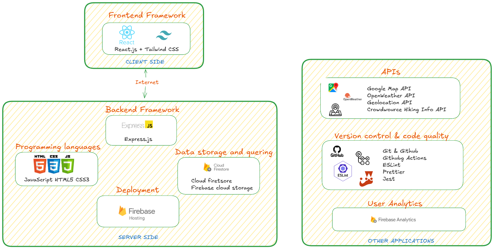

# Technology Stack for the Hiking Logbook Web Application

The Hiking Logbook is built using a modern, integrated technology stack designed to streamline development, ensure scalability, and deliver a seamless user experience. Each technology has been carefully chosen to align with the project requirements for functionality, maintainability, and performance.

---

## 1. Overview

The Hiking Logbook is a single-page web application where the frontend (**React + Tailwind**) communicates directly with **Firebase** backend services via Firebase SDKs. This eliminates the need for a self-hosted backend, reducing infrastructure complexity.

User actions, such as logging a hike or checking the weather for a trail, trigger either:  
- Direct data reads/writes to **Cloud Firestore**  
- Calls to **Cloud Functions** for additional logic or external API requests  

External APIs (**Google Maps**, **OpenWeather**, **Geolocation**, **Crowdsource Hiking Info**) provide real-time, location-based services, integrated through Firebase Cloud Functions or directly in the frontend where appropriate.  

All deployments are managed through **GitHub Actions** to Firebase Hosting, ensuring that every update passes linting, testing, and CI/CD checks before going live.

  
*Diagram showcasing the different components of the tech stack.*

---

## 2. Programming Languages

- **JavaScript (ES6+)** – The primary programming language for both the frontend and backend, allowing a unified development experience. Using JavaScript across the stack enables faster development and either knowledge sharing within the team.
- **HTML5** – Structures the frontend content and ensures semantic, accessible design.
- **CSS3** – Styles and ensures responsive layouts, supported by Tailwind CSS.

---

## 3. Frontend

The frontend forms the user interface of the Hiking Logbook, where users can log hikes, view routes, and check the weather.

### Framework: React.js
- **Purpose:** Build a fast, interactive, and component-based UI.
- **Reasons:**
  - Highly popular and well-supported
  - Efficient state management and reusable components
  - Large ecosystem of third-party libraries

### Framework: Tailwind CSS
- **Purpose:** Rapidly design responsive and modern UI.
- **Reasons:**
  - Utility-first CSS framework
  - Integrated with React for quick prototyping
  - Mobile-first and highly customizable

### Additional Frontend Tools
- **React Router** – Client-side routing for smooth navigation between views.
- **Jest & React Testing Library** – Unit and integration testing to reduce bugs in production.

---

## 4. Backend as a Service (BaaS) – Firebase

Instead of a custom backend, **Firebase** provides backend infrastructure with high reliability and scalability.

### Firebase
- **Purpose:** Authentication, database, hosting, and backend services without manual server setup.
- **Reasons:**
  - Real-time database support
  - Built-in authentication providers
  - Free tier for MVP development
  - Seamless React integration

### Firebase Services Used
- **Firebase Authentication** – Independent, secure user sign-in system
- **Cloud Firestore** – NoSQL database for logbook data, planned hikes, achievements, and friend lists
- **Firebase Hosting** – Deployment of frontend
- **Firebase Functions** – Serverless backend logic

### Framework: Express.js
- **Purpose:** Build lightweight, flexible server-side apps and APIs.
- **Reasons:**
  - Minimal framework with flexible structure
  - Simplifies RESTful API creation

---

## 5. APIs & External Services

The Hiking Logbook integrates several APIs to enhance functionality:

- **Google Maps API (or Leaflet)** – Trail maps, route planning, location search.
- **OpenWeather API** – Real-time weather data for hiking locations.
- **Geolocation API** – Tracks live location and distance during hikes.
- **Crowdsource Hiking Info API** – Real-time hiking events and activities from the global community.

---

## 6. Development & Code Quality Tools

- **Git & GitHub** – Version control, ensuring safe collaboration through feature branches, pull requests, and code reviews.
- **GitHub Actions (CI/CD)** – Automates build, linting, testing, and deployment, ensuring that only tested and compliant code is deployed.
- **ESLint** – Automatically detects and flags code issues, enforcing consistent coding standards.
- **Prettier** – Formats code to maintain visual consistency across the project.
- **Jest** – Provides a testing framework for both frontend and Firebase Functions, ensuring correctness and preventing regressions.

---
