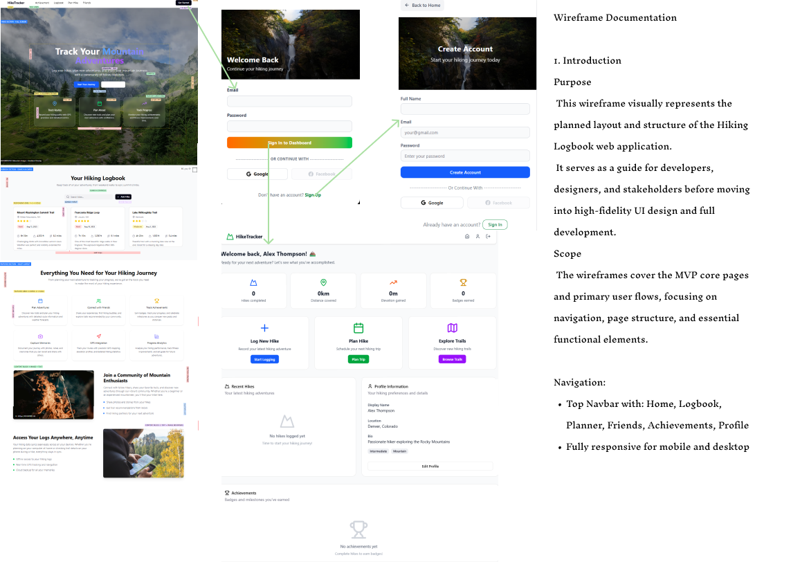

# UX Documentation

## Overview

This wireframe represents the unified user interface of the Hiking Logbook application, including login, dashboard, and key user interactions. It serves as a blueprint for the visual layout and functional elements.

---

## 1. Login Section

- **Email and Password Fields**: Allow users to enter their credentials.
- **Sign In Button**: Submits the login form; includes loading state feedback.
- **Error Alerts**: Display when login fails or required fields are empty.
- **Social Login Options**: Google login is active; Facebook placeholder present.
- **Sign Up Call-to-Action**: Link/button to redirect new users to the registration flow.
- **Background Banner**: Hiking-themed image with gradient overlay, featuring a welcome message for engagement.

---

## 2. Dashboard Section

- **Welcome Header**: Personalized greeting with user's display name and motivational subtext.
- **Stats Overview Cards**: Display key metrics such as Total Hikes, Total Distance, Total Elevation, and Achievements, each with icons, bold metrics, and descriptive text.
- **Quick Action Cards**: Buttons for "Log New Hike," "Plan Hike," and "Explore Trails" to encourage engagement with primary actions.
- **Recent Activity / Profile Info**:
  - Recent hikes placeholder or encouragement text if no hikes are logged.
  - Profile information including display name, location, bio, and hiking preferences with visual badges.
  - Edit profile button for user customization.
- **Achievements Section**: Grid of earned badges with icons and labels; placeholder text encourages progress if no achievements exist.

---

## 3. UX Considerations

- Clear **visual hierarchy** using cards, headings, and icons to separate content areas.
- Motivational imagery aligns with the hiking/outdoor theme and enhances user engagement.
- Interactive elements such as buttons and badges provide clear feedback and intuitive navigation.
- Minimalist design reduces cognitive load, emphasizing primary actions and important metrics.
- Single wireframe accommodates login, dashboard overview, and user interaction in one unified view.

---

**Note:** The wireframe is intended as a presentation-friendly visual for documentation purposes and consolidates multiple screens into a single page layout.
